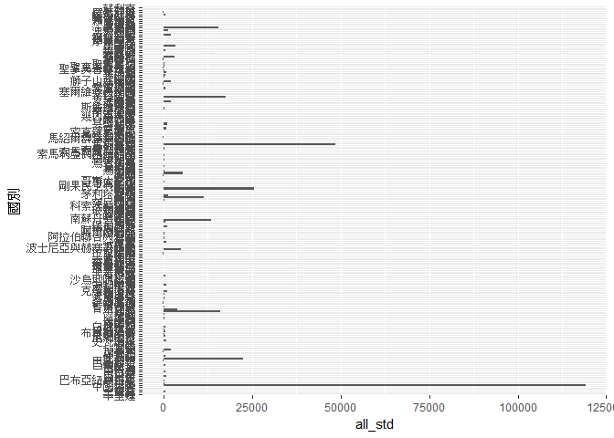
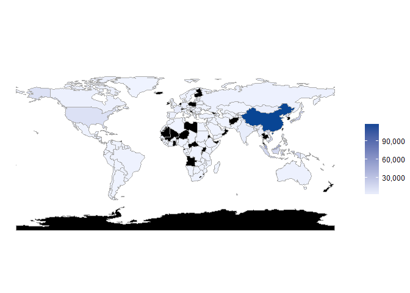
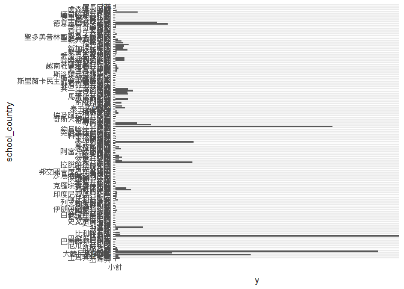
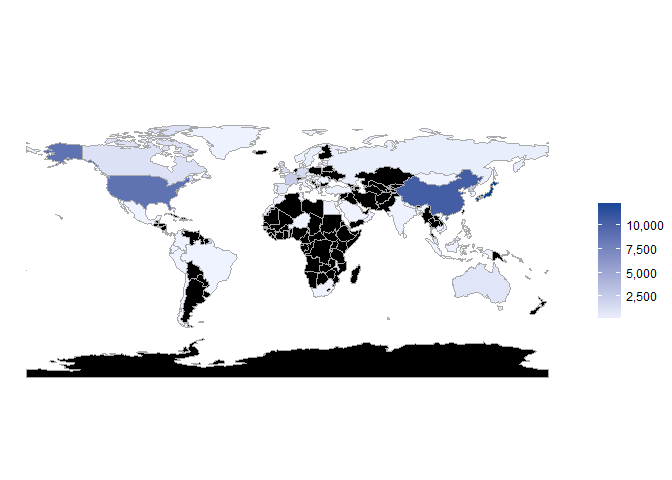
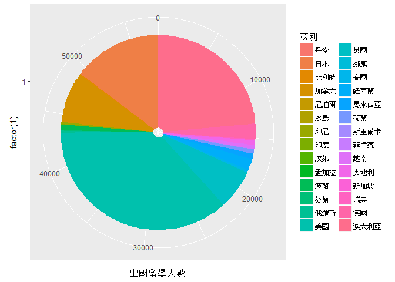

106-2 大數據分析方法 作業二
================
Yi-Ju Tseng

作業完整說明[連結](https://docs.google.com/document/d/1aLGSsGXhgOVgwzSg9JdaNz2qGPQJSoupDAQownkGf_I/edit?usp=sharing)

學習再也不限定在自己出生的國家，台灣每年有許多學生選擇就讀國外的大專院校，同時也有人多國外的學生來台灣就讀，透過分析[大專校院境外學生人數統計](https://data.gov.tw/dataset/6289)、[大專校院本國學生出國進修交流數](https://data.gov.tw/dataset/24730)、[世界各主要國家之我國留學生人數統計表](https://ws.moe.edu.tw/Download.ashx?u=C099358C81D4876CC7586B178A6BD6D5062C39FB76BDE7EC7685C1A3C0846BCDD2B4F4C2FE907C3E7E96F97D24487065577A728C59D4D9A4ECDFF432EA5A114C8B01E4AFECC637696DE4DAECA03BB417&n=4E402A02CE6F0B6C1B3C7E89FDA1FAD0B5DDFA6F3DA74E2DA06AE927F09433CFBC07A1910C169A1845D8EB78BD7D60D7414F74617F2A6B71DC86D17C9DA3781394EF5794EEA7363C&icon=..csv)可以了解103年以後各大專院校國際交流的情形。請同學分析以下議題，並以視覺化的方式呈現分析結果，呈現103年以後大專院校國際交流的情形。

來台境外生分析
--------------

### 資料匯入與處理

``` r
library(readr)
library(dplyr)
```

    ## 
    ## Attaching package: 'dplyr'

    ## The following objects are masked from 'package:stats':
    ## 
    ##     filter, lag

    ## The following objects are masked from 'package:base':
    ## 
    ##     intersect, setdiff, setequal, union

``` r
library(ggplot2) 
library(choroplethr)
```

    ## Loading required package: acs

    ## Loading required package: stringr

    ## Loading required package: XML

    ## 
    ## Attaching package: 'acs'

    ## The following object is masked from 'package:dplyr':
    ## 
    ##     combine

    ## The following object is masked from 'package:base':
    ## 
    ##     apply

``` r
##分別匯入以國家與學校區分的103年以後(104-106)的大專校院境外學生人數統計資料
fs104_school<- read_csv("http://stats.moe.gov.tw/files/detail/104/104_ab104_S.csv")
```

    ## Parsed with column specification:
    ## cols(
    ##   學校類型 = col_character(),
    ##   學校代碼 = col_character(),
    ##   學校名稱 = col_character(),
    ##   `學位生-正式修讀學位外國生` = col_integer(),
    ##   `學位生-僑生(含港澳)` = col_integer(),
    ##   `學位生-正式修讀學位陸生` = col_integer(),
    ##   `非學位生-外國交換生` = col_integer(),
    ##   `非學位生-外國短期研習及個人選讀` = col_integer(),
    ##   `非學位生-大專附設華語文中心學生` = col_integer(),
    ##   `非學位生-大陸研修生` = col_character(),
    ##   `非學位生-海青班` = col_integer(),
    ##   境外專班 = col_integer()
    ## )

``` r
fs104_country<- read_csv("http://stats.moe.gov.tw/files/detail/104/104_ab104_C.csv")
```

    ## Parsed with column specification:
    ## cols(
    ##   洲別 = col_character(),
    ##   國別 = col_character(),
    ##   `學位生-正式修讀學位外國生` = col_integer(),
    ##   `學位生-僑生(含港澳)` = col_integer(),
    ##   `學位生-正式修讀學位陸生` = col_integer(),
    ##   `非學位生-外國交換生` = col_integer(),
    ##   `非學位生-外國短期研習及個人選讀` = col_integer(),
    ##   `非學位生-大專附設華語文中心學生` = col_integer(),
    ##   `非學位生-大陸研修生` = col_integer(),
    ##   `非學位生-海青班` = col_integer(),
    ##   境外專班 = col_integer()
    ## )

``` r
fs105_school<- read_csv("http://stats.moe.gov.tw/files/detail/105/105_ab105_S.csv")
```

    ## Parsed with column specification:
    ## cols(
    ##   學校類型 = col_character(),
    ##   學校代碼 = col_character(),
    ##   學校名稱 = col_character(),
    ##   學位生_正式修讀學位外國生 = col_integer(),
    ##   `學位生_僑生(含港澳)` = col_integer(),
    ##   學位生_正式修讀學位陸生 = col_integer(),
    ##   非學位生_外國交換生 = col_integer(),
    ##   非學位生_外國短期研習及個人選讀 = col_integer(),
    ##   非學位生_大專附設華語文中心學生 = col_integer(),
    ##   非學位生_大陸研修生 = col_integer(),
    ##   非學位生_海青班 = col_integer(),
    ##   境外專班 = col_integer()
    ## )

``` r
fs105_country<- read_csv("http://stats.moe.gov.tw/files/detail/105/105_ab105_C.csv")
```

    ## Parsed with column specification:
    ## cols(
    ##   洲別 = col_character(),
    ##   國別 = col_character(),
    ##   學位生_正式修讀學位外國生 = col_integer(),
    ##   `學位生_僑生(含港澳)` = col_integer(),
    ##   學位生_正式修讀學位陸生 = col_integer(),
    ##   非學位生_外國交換生 = col_integer(),
    ##   非學位生_外國短期研習及個人選讀 = col_integer(),
    ##   非學位生_大專附設華語文中心學生 = col_integer(),
    ##   非學位生_大陸研修生 = col_integer(),
    ##   非學位生_海青班 = col_integer(),
    ##   境外專班 = col_integer()
    ## )

``` r
fs106_school<- read_csv("http://stats.moe.gov.tw/files/detail/106/106_ab105_S.csv")
```

    ## Parsed with column specification:
    ## cols(
    ##   學校類型 = col_character(),
    ##   學校代碼 = col_character(),
    ##   學校名稱 = col_character(),
    ##   學位生_正式修讀學位外國生 = col_integer(),
    ##   `學位生_僑生(含港澳)` = col_integer(),
    ##   學位生_正式修讀學位陸生 = col_integer(),
    ##   非學位生_外國交換生 = col_integer(),
    ##   非學位生_外國短期研習及個人選讀 = col_integer(),
    ##   非學位生_大專附設華語文中心學生 = col_integer(),
    ##   非學位生_大陸研修生 = col_integer(),
    ##   非學位生_海青班 = col_integer(),
    ##   境外專班 = col_integer()
    ## )

``` r
fs106_country<- read_csv("http://stats.moe.gov.tw/files/detail/106/106_ab105_C.csv")
```

    ## Parsed with column specification:
    ## cols(
    ##   洲別 = col_character(),
    ##   國別 = col_character(),
    ##   學位生_正式修讀學位外國生 = col_integer(),
    ##   `學位生_僑生(含港澳)` = col_integer(),
    ##   學位生_正式修讀學位陸生 = col_integer(),
    ##   非學位生_外國交換生 = col_integer(),
    ##   非學位生_外國短期研習及個人選讀 = col_integer(),
    ##   非學位生_大專附設華語文中心學生 = col_integer(),
    ##   非學位生_大陸研修生 = col_integer(),
    ##   非學位生_海青班 = col_integer(),
    ##   境外專班 = col_integer()
    ## )

``` r
##匯入國家名稱中英文對照表(已加入資料夾)
map_en<- read_csv("CountriesComparisionTable.csv")
```

    ## Parsed with column specification:
    ## cols(
    ##   ISO3 = col_character(),
    ##   English = col_character(),
    ##   Taiwan = col_character()
    ## )

### 哪些國家來台灣唸書的學生最多呢？

``` r
fs104_country<-mutate(fs104_country,totalstd=`學位生-正式修讀學位外國生`+`學位生-僑生(含港澳)`+
                        `學位生-正式修讀學位陸生`+`非學位生-外國交換生`+`非學位生-外國短期研習及個人選讀`+
                        `非學位生-大專附設華語文中心學生`+`非學位生-大陸研修生`+`非學位生-海青班`+境外專班)
fs105_country<-mutate(fs105_country,totalstd=學位生_正式修讀學位外國生+`學位生_僑生(含港澳)`+
                        學位生_正式修讀學位陸生+非學位生_外國交換生+非學位生_外國短期研習及個人選讀+
                        非學位生_大專附設華語文中心學生+非學位生_大陸研修生+非學位生_海青班+境外專班)
fs106_country<-mutate(fs106_country,totalstd=學位生_正式修讀學位外國生+`學位生_僑生(含港澳)`+
                        學位生_正式修讀學位陸生+非學位生_外國交換生+非學位生_外國短期研習及個人選讀+
                        非學位生_大專附設華語文中心學生+非學位生_大陸研修生+非學位生_海青班+境外專班)

allcountrystd<-merge(fs104_country,fs105_country,by="國別",all=T)%>%merge(fs106_country,by="國別",all=T)
allcountrystd$totalstd.x[is.na(allcountrystd$totalstd.x)]<-0
allcountrystd<-mutate(allcountrystd,all_std=totalstd.x+totalstd.y+totalstd)
select_10country<-arrange(allcountrystd,desc(all_std))%>%select("國別",all_std)
library(knitr)
##以表格的方式呈現前十個來台學生人數最多的國家
knitr::kable(head(select_10country,10))
```

| 國別     |  all\_std|
|:---------|---------:|
| 中國大陸 |    119236|
| 馬來西亞 |     48646|
| 香港     |     25654|
| 日本     |     22384|
| 越南     |     17665|
| 印尼     |     16061|
| 澳門     |     15579|
| 南韓     |     13361|
| 美國     |     11518|
| 泰國     |      5500|

### 哪間大學的境外生最多呢？

``` r
fs104_school$`非學位生-大陸研修生`<-gsub("…",replacement=0,fs104_school$`非學位生-大陸研修生`)
fs104_school$`非學位生-大陸研修生`<-as.numeric(fs104_school$`非學位生-大陸研修生`)


fs104_school<-mutate(fs104_school,totalstd=`學位生-正式修讀學位外國生`+`學位生-僑生(含港澳)`+
                       `學位生-正式修讀學位陸生`+`非學位生-外國交換生`+`非學位生-外國短期研習及個人選讀`+
                       `非學位生-大專附設華語文中心學生`+`非學位生-大陸研修生`+`非學位生-海青班`+境外專班)
fs105_school<-mutate(fs105_school,totalstd=學位生_正式修讀學位外國生+`學位生_僑生(含港澳)`+
                       學位生_正式修讀學位陸生+非學位生_外國交換生+非學位生_外國短期研習及個人選讀+
                       非學位生_大專附設華語文中心學生+非學位生_大陸研修生+非學位生_海青班+境外專班)
fs106_school<-mutate(fs106_school,totalstd=學位生_正式修讀學位外國生+`學位生_僑生(含港澳)`+
                       學位生_正式修讀學位陸生+非學位生_外國交換生+非學位生_外國短期研習及個人選讀+
                       非學位生_大專附設華語文中心學生+非學位生_大陸研修生+非學位生_海青班+境外專班)

allschoolstd<-merge(fs104_school,fs105_school,by="學校名稱",all=T)%>%merge(fs106_school,by="學校名稱",all=T)
allschoolstd$totalstd.x[is.na(allschoolstd$totalstd.x)]<-0
allschoolstd<-mutate(allschoolstd,all_std=totalstd.x+totalstd.y+totalstd)
select_10school<-arrange(allschoolstd,desc(all_std))%>%select("學校名稱",all_std)
##以表格的方式呈現前十個境外生人數最多的學校
knitr::kable(head(select_10school,10))
```

| 學校名稱         |  all\_std|
|:-----------------|---------:|
| 無法區分校別     |     92586|
| 國立臺灣師範大學 |     17465|
| 國立臺灣大學     |     14399|
| 銘傳大學         |     12605|
| 中國文化大學     |     11937|
| 淡江大學         |     10901|
| 國立政治大學     |      8921|
| 國立成功大學     |      8597|
| 逢甲大學         |      7442|
| 輔仁大學         |      7223|

### 各個國家來台灣唸書的學生人數條狀圖

``` r
##以bar chart顯示各個國家來台念書人數
ggplot()+geom_bar(data=allcountrystd,aes(x=國別,y=all_std),stat = "identity")+coord_flip()
```

    ## Warning: Removed 15 rows containing missing values (position_stack).



### 各個國家來台灣唸書的學生人數面量圖

``` r
draw_country<-select(allcountrystd,Taiwan="國別",all_std)
draw_country<-merge(draw_country,map_en,by="Taiwan")%>%select(c("English","all_std"))#與國家名稱中英對照資料合併
draw_country<-draw_country[complete.cases(draw_country$all_std),]#去除NA值
colnames(draw_country)<- c("region", "value")
draw_country$region<-tolower(draw_country$region)#將國家的英文名稱全部轉換成小寫
draw_country<-group_by(draw_country,region)%>%summarise(value=sum(value))#以國家名稱分組,若有重複的就將統計人數相加
draw_country$region<- gsub("and", "", draw_country$region, fixed=TRUE)#取代不合函式邏輯的資料
country_choropleth(draw_country,num_colors=1)#呈現面量圖並讓數量多的顏色越深
```

    ## Warning in super$initialize(country.map, user.df): Your data.frame contains
    ## the following regions which are not mappable: bosnia herzegovina, finl,
    ## icel, irel, netherls, new zeal, pol, rwa, singapore, solomon isls, swazil,
    ## switzerl, thail, trinidad tobago, uga, unmatch

    ## Warning in self$bind(): The following regions were missing and are being
    ## set to NA: afghanistan, angola, mali, montenegro, mauritania, burundi,
    ## niger, netherlands, new zealand, oman, poland, qatar, rwanda, western
    ## sahara, solomon islands, somaliland, swaziland, togo, thailand, east timor,
    ## trinidad and tobago, taiwan, uganda, vanuatu, bosnia and herzegovina,
    ## central african republic, switzerland, northern cyprus, cyprus, djibouti,
    ## eritrea, finland, georgia, ghana, antarctica, guinea bissau, equatorial
    ## guinea, ireland, iceland, south korea, kosovo, lebanon, libya, lesotho



台灣學生國際交流分析
--------------------

### 資料匯入與處理

``` r
##匯入手動更改合併儲存格後的大專校院本國學生出國進修交流數資料
taiwan_std<-read_csv("Student_RPT_07.csv",locale = locale(encoding = "BIG5"))
```

    ## Parsed with column specification:
    ## cols(
    ##   學年度 = col_integer(),
    ##   學期 = col_integer(),
    ##   設立別 = col_character(),
    ##   學校類別 = col_character(),
    ##   學校代碼 = col_character(),
    ##   學校名稱 = col_character(),
    ##   系所代碼 = col_integer(),
    ##   系所名稱 = col_character(),
    ##   學制 = col_character(),
    ##   `對方學校(機構)國別(地區)` = col_character(),
    ##   中文名稱 = col_character(),
    ##   英文名稱 = col_character(),
    ##   小計 = col_integer(),
    ##   男 = col_integer(),
    ##   女 = col_integer()
    ## )

    ## Warning in rbind(names(probs), probs_f): number of columns of result is not
    ## a multiple of vector length (arg 1)

    ## Warning: 10 parsing failures.
    ## row # A tibble: 5 x 5 col     row col      expected               actual                      file   expected   <int> <chr>    <chr>                  <chr>                       <chr>  actual 1 23579 系所代碼 no trailing characters A2                          'Stud~ file 2 34284 系所代碼 no trailing characters A2                          'Stud~ row 3 35022 學年度   an integer             統計說明：                  'Stud~ col 4 35023 學年度   no trailing characters . 本表設立別係指【公立、私立】大學校院等分類；學校~ 'Stud~ expected 5 35024 學年度   no trailing characters . 本表「學制」係指【二專(日間)、二專(進修)、五~ 'Stud~
    ## ... ................. ... .......................................................................... ........ .......................................................................... ...... ...................................................................... .... ...................................................................... ... .................................................................. ... ....................................................................... ........ .......................................................................
    ## See problems(...) for more details.

### 台灣大專院校的學生最喜歡去哪些國家進修交流呢？

``` r
taiwan_std$`對方學校(機構)國別(地區)`->taiwan_std$school_country #更改成英文欄位以便後續運算
most_twstdgo<-group_by(taiwan_std,school_country)%>%select(school_country,"小計")%>%
  summarize(count_std=sum(小計))%>%arrange(desc(count_std))#以國家名稱分組後篩選出來再加總,並由大到小排列
##以表格的方式呈現前十個台灣大專院校的學生最喜歡去的國家
knitr::kable(head(most_twstdgo,10))
```

| school\_country  |  count\_std|
|:-----------------|-----------:|
| 日本             |       12430|
| 中國大陸         |       10429|
| 美國             |        8916|
| 大陸地區         |        5996|
| 南韓             |        2498|
| 法國             |        2415|
| 大韓民國(南韓)   |        2131|
| 德國             |        1706|
| 德意志聯邦共和國 |        1458|
| 英國             |        1416|

### 哪間大學的出國交流學生數最多呢？

``` r
most_schoolstdgo<-group_by(taiwan_std,學校名稱)%>%select("學校名稱","小計")%>%
  summarize(count_std=sum(小計))%>%arrange(desc(count_std))#以學校名稱分組後篩選出來再加總,並由大到小排列
##以表格的方式呈現前十間出國交流學生數最多的大學
knitr::kable(head(most_schoolstdgo,10))
```

| 學校名稱     |  count\_std|
|:-------------|-----------:|
| 國立臺灣大學 |        4719|
| 淡江大學     |        3794|
| 國立政治大學 |        3479|
| 逢甲大學     |        2646|
| 東海大學     |        1881|
| 元智大學     |        1864|
| 國立交通大學 |        1513|
| 東吳大學     |        1457|
| 國立成功大學 |        1397|
| 國立臺北大學 |        1397|

### 台灣大專院校的學生最喜歡去哪些國家進修交流條狀圖

``` r
##以bar chart顯示台灣大專院校的學生最喜歡去進修交流的國家
ggplot()+geom_bar(data=taiwan_std,aes(x=school_country,y="小計"),stat = "identity")+coord_flip()
```



### 台灣大專院校的學生最喜歡去哪些國家進修交流面量圖

``` r
draw_moststdgo<-select(taiwan_std,Taiwan="school_country","小計")
draw_moststdgo<-merge(draw_moststdgo,map_en,by="Taiwan")%>%select(c("English","小計"))#與國家名稱中英對照資料合併
colnames(draw_moststdgo)<- c("region", "value")
draw_moststdgo$region<-tolower(draw_moststdgo$region)#將國家的英文名稱全部轉換成小寫
draw_moststdgo<-group_by(draw_moststdgo,region)%>%summarise(value=sum(value))#以國家名稱分組,若有重複的就將統計人數相加
draw_moststdgo$region<- gsub("and", "", draw_moststdgo$region, fixed=TRUE)#取代不合函式邏輯的資料
country_choropleth(draw_moststdgo,num_colors=1)#呈現面量圖並讓數量多的顏色越深
```

    ## Warning in super$initialize(country.map, user.df): Your data.frame contains
    ## the following regions which are not mappable: finl, icel, irel, netherls,
    ## new zeal, pol, singapore, solomon isls, swazil, switzerl, thail, unmatch

    ## Warning in self$bind(): The following regions were missing and are being
    ## set to NA: afghanistan, angola, azerbaijan, moldova, madagascar, macedonia,
    ## mali, myanmar, montenegro, mozambique, mauritania, burundi, namibia,
    ## nigeria, nicaragua, netherlands, new zealand, pakistan, papua new guinea,
    ## poland, benin, paraguay, rwanda, western sahara, sudan, burkina faso, south
    ## sudan, senegal, solomon islands, sierra leone, el salvador, somaliland,
    ## somalia, suriname, swaziland, syria, chad, togo, thailand, tajikistan,
    ## turkmenistan, east timor, bulgaria, trinidad and tobago, taiwan, united
    ## republic of tanzania, uganda, ukraine, uruguay, uzbekistan, the bahamas,
    ## venezuela, vanuatu, yemen, zambia, zimbabwe, bosnia and herzegovina,
    ## belarus, albania, bolivia, bhutan, botswana, central african republic,
    ## switzerland, united arab emirates, ivory coast, cameroon, democratic
    ## republic of the congo, republic of congo, cuba, northern cyprus, cyprus,
    ## argentina, djibouti, dominican republic, algeria, eritrea, armenia,
    ## ethiopia, finland, gabon, georgia, ghana, antarctica, guinea, gambia,
    ## guinea bissau, equatorial guinea, guatemala, guyana, honduras, haiti,
    ## ireland, iran, iraq, iceland, kazakhstan, kenya, kyrgyzstan, kosovo, laos,
    ## lebanon, liberia, libya, lesotho, luxembourg



台灣學生出國留學分析
--------------------

### 資料匯入與處理

``` r
##匯入世界各主要國家之我國留學生人數統計資料
world_tstd<-read_csv("https://ws.moe.edu.tw/Download.ashx?u=C099358C81D4876CC7586B178A6BD6D5062C39FB76BDE7EC7685C1A3C0846BCDD2B4F4C2FE907C3E7E96F97D24487065577A728C59D4D9A4ECDFF432EA5A114C8B01E4AFECC637696DE4DAECA03BB417&n=4E402A02CE6F0B6C1B3C7E89FDA1FAD0B5DDFA6F3DA74E2DA06AE927F09433CFBC07A1910C169A1845D8EB78BD7D60D7414F74617F2A6B71DC86D17C9DA3781394EF5794EEA7363C&icon=..csv")
```

    ## Warning: Missing column names filled in: 'X4' [4], 'X5' [5], 'X6' [6]

    ## Parsed with column specification:
    ## cols(
    ##   洲別 = col_character(),
    ##   國別 = col_character(),
    ##   總人數 = col_number(),
    ##   X4 = col_character(),
    ##   X5 = col_character(),
    ##   X6 = col_character()
    ## )

### 台灣學生最喜歡去哪些國家留學呢？

``` r
world_tstd<-select(world_tstd,"國別","總人數")
most_like_country<-arrange(world_tstd,desc(總人數))#以總人數排序大到小台灣學生最喜歡去留學的國家
##以表格的方式呈現前十個台灣學生最喜歡去留學的國家
knitr::kable(head(most_like_country,10))
```

| 國別     | 總人數 |
|:---------|:------:|
| 美國     |  21127 |
| 澳大利亞 |  13582 |
| 日本     |  8444  |
| 加拿大   |  4827  |
| 英國     |  3815  |
| 德國     |  1488  |
| 紐西蘭   |  1106  |
| 波蘭     |   561  |
| 馬來西亞 |   502  |
| 奧地利   |   419  |

### 台灣學生最喜歡去哪些國家留學面量圖

``` r
draw_stdgoworld<-select(world_tstd,Taiwan="國別","總人數")
draw_stdgoworld<-merge(draw_stdgoworld,map_en,by="Taiwan")%>%select(c("English","總人數"))#與國家名稱中英對照資料合併
colnames(draw_stdgoworld)<- c("region", "value")
draw_stdgoworld$region<-tolower(draw_stdgoworld$region)#將國家的英文名稱全部轉換成小寫
draw_stdgoworld<-group_by(draw_stdgoworld,region)%>%summarise(value=sum(value))#以國家名稱分組,若有重複的就將統計人數相加
draw_stdgoworld$region<- gsub("and", "", draw_stdgoworld$region, fixed=TRUE)#取代不合函式邏輯的資料
country_choropleth(draw_stdgoworld,num_colors=1)#呈現面量圖並讓數量多的顏色越深
```

    ## Warning in super$initialize(country.map, user.df): Your data.frame contains
    ## the following regions which are not mappable: finl, icel, netherls, new
    ## zeal, pol, singapore, thail

    ## Warning in self$bind(): The following regions were missing and are being
    ## set to NA: afghanistan, angola, azerbaijan, moldova, madagascar, mexico,
    ## macedonia, mali, myanmar, montenegro, mongolia, mozambique, mauritania,
    ## burundi, malawi, namibia, france, niger, nigeria, nicaragua, netherlands,
    ## new zealand, oman, pakistan, panama, peru, papua new guinea, poland, benin,
    ## portugal, paraguay, israel, qatar, romania, rwanda, western sahara, saudi
    ## arabia, sudan, burkina faso, south sudan, senegal, solomon islands, sierra
    ## leone, el salvador, somaliland, somalia, republic of serbia, suriname,
    ## slovakia, slovenia, swaziland, syria, chad, togo, thailand, tajikistan,
    ## turkmenistan, east timor, bulgaria, trinidad and tobago, tunisia, turkey,
    ## taiwan, united republic of tanzania, uganda, ukraine, uruguay, uzbekistan,
    ## the bahamas, venezuela, vanuatu, yemen, south africa, zambia, zimbabwe,
    ## bosnia and herzegovina, belarus, albania, belize, bolivia, brazil, bhutan,
    ## botswana, central african republic, switzerland, chile, united arab
    ## emirates, china, ivory coast, cameroon, democratic republic of the congo,
    ## republic of congo, colombia, costa rica, cuba, northern cyprus, cyprus,
    ## argentina, czech republic, djibouti, dominican republic, algeria, ecuador,
    ## egypt, eritrea, spain, armenia, estonia, ethiopia, finland, fiji, gabon,
    ## georgia, ghana, antarctica, guinea, gambia, guinea bissau, equatorial
    ## guinea, greece, guatemala, guyana, honduras, croatia, haiti, hungary,
    ## ireland, iran, iraq, iceland, italy, jamaica, jordan, kazakhstan, kenya,
    ## kyrgyzstan, cambodia, south korea, kosovo, kuwait, laos, lebanon, liberia,
    ## libya, lesotho, lithuania, luxembourg, latvia, morocco


綜合分析
--------

請問來台讀書與離台讀書的來源國與留學國趨勢是否相同(5分)？想來台灣唸書的境外生，他們的母國也有很多台籍生嗎？請圖文並茂說明你的觀察(10分)。 A:從兩張圓餅圖的分布來看，來台灣讀書人數最多的國家是馬來西亞，第二名是日本。而台灣出國讀書人數最多的國家則是美國，第二名是丹麥。由此可見，會來台灣讀書的外國學生通常是亞洲人居多，很有可能是生活習慣較接近、中文逐漸成為重要語言的緣故。台灣學生比較偏向前往差異較大的歐美國家學習，很有可能是為了增進英美語系語言的應用、並且開拓視野、體驗不同生活環境所選擇。

``` r
compare_std<-merge(select_10country,most_like_country,"國別")
colnames(compare_std)<-c("國別","來台讀書人數","出國留學人數")

ggplot(data=compare_std) +geom_bar(aes(x=factor(1),y=來台讀書人數,fill=國別),stat = "identity") +coord_polar("y", start=0)
```


``` r
ggplot(data=compare_std) +geom_bar(aes(x=factor(1),y=出國留學人數,fill=國別),stat = "identity") +coord_polar("y", start=0)
```


